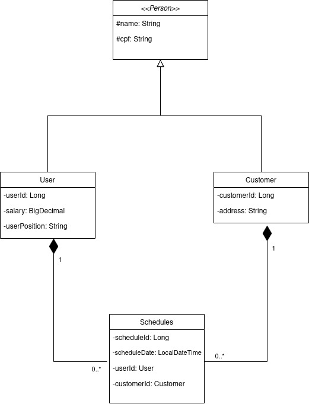
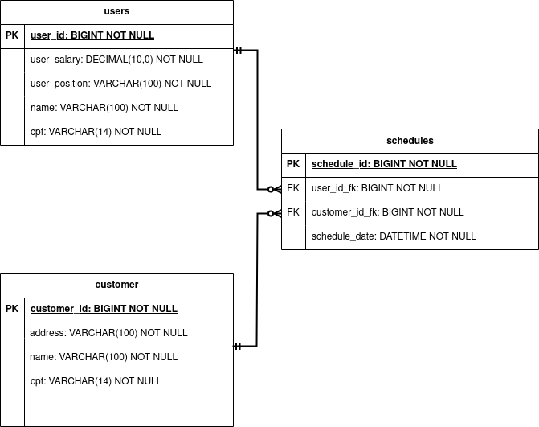
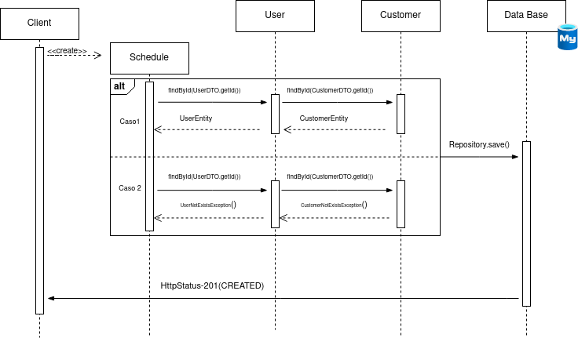

# BeautyFast

API BeutyFast foi criada como projeto de conclusão do curso de **Engenharia de Software** na universidade **Unicesumar**, com
a motivação de aproximar fornecedores e clientes de serviços estéticos, onde abordo a problemática da desigualdade social 
e o alcance de uma solução de software democrática para pessoas de baixa renda, que busca resolver
o problema logístico existente a um custo acessível. Para chegar a esse fim utilizei de
metodologias aprendidas durante os anos de graduação, em específico um conjunto de
metodologia ágil e ferramenta case populares no mercado, o scrum e o quadro kanban ou
como é também conhecido scrumban. É valido ressaltar que este é um projeto piloto e um *MVP* do que foi idealizado como 
projeto final. 

### Configurações
Estas são as dependências utilizadas até o momento no projeto, para o arquivo `pom.xml` encontramos `spring-boot-starter-data-jpa` - 
`spring-boot-starter-validation` - `spring-boot-starter-web` - `spring-boot-devtools` - `mysql-connector-j` - `flyway-mysql` -
`lombok` - `spring-boot-starter-test` - `modelmapper`.

### Arquivo Jar
O arquivo do build de artefato do projeto se encontra -> [Aqui](out/artifacts/api_beautyfast_jar/api-beautyfast.jar)

### Diagramas

#### Diagrama de Classe: 
A primeira diagramação que foi construída para o projeto foi
o diagrama de classes, iniciei a construção pensando na classe mais genérica que
seria a classe pessoa, que na API é representada por uma classe abstrata herdada
por duas outras classes que executam seus respectivos polimorfismos, as classes
Usuário e Cliente. Após como é observado, temos uma relação de composição entre
a classe de agendamento (Schedules) com a cardinalidade um para muitos, sendo
que um agendamento não pode existir sem um usuário e um cliente.

#### Diagrama Entidade Relacional:
A segunda diagramação escolhida foi para
a visualização da construção das tabelas do banco de dados e suas relações,
como é possível observar no diagrama abaixo o modelo utilizado foi o de Martin
(pé de galinha), onde possuí uma cardinalidade entre as entidades usuários e
clientes para com agendamentos(schedules) de zero ou muitos agendamentos,
e o inverso desta condição mostra uma cardinalidade de um e apenas um
usuário e cliente para cada agendamento.

#### Diagrama de Sequência:
Por ultimo o digrama escolhido foi para a
demonstração do principal caso de uso da API, o cadastro de um
agendamento que possua como requisitos um usuário e um cliente já
registrados no banco de dados, como é observado no diagrama a mensagem
de criação é iniciada no cliente da requisição, dando inicio ao objeto de
agendamento que está encapsulado por um frame do tipo alt de decisão e são descritos 
dois casos, um onde o retorno é de sucesso para as entidades
pesquisadas e o segundo uma exception personalizada é lançada. Caso o fluxo
de sucesso seja trilhado, um método save() é enviado e gerado um SQL apartir
da aplicação JPA do ambiente spring, e persistida na base de dados MySQL,
retornando ao cliente da requisição um HTTP status 201 que significa que o
agendamento foi criado.

## Links do Projeto

Abaixo plataformas onde estão hospedados alguns links do projeto.

| Plataform    | Link                                                                                            |
|--------------|-------------------------------------------------------------------------------------------------|
| DockerHub    | -*-                                                                                             |
| GitHub       | https://github.com/matheusnicolau-tcc/beautyfast                                                |
| Drive        | https://drive.google.com/drive/u/2/folders/1-44yDfLyEbLz_kkzmSQYOKGiGmhgT7Fn                    |
| Quadro Sprint | https://trello.com/invite/b/WZQeBvn9/ATTI6b3381bfc6b73419545e7ba1a1529d641F20D9B8/sprint-tcc-01 |
